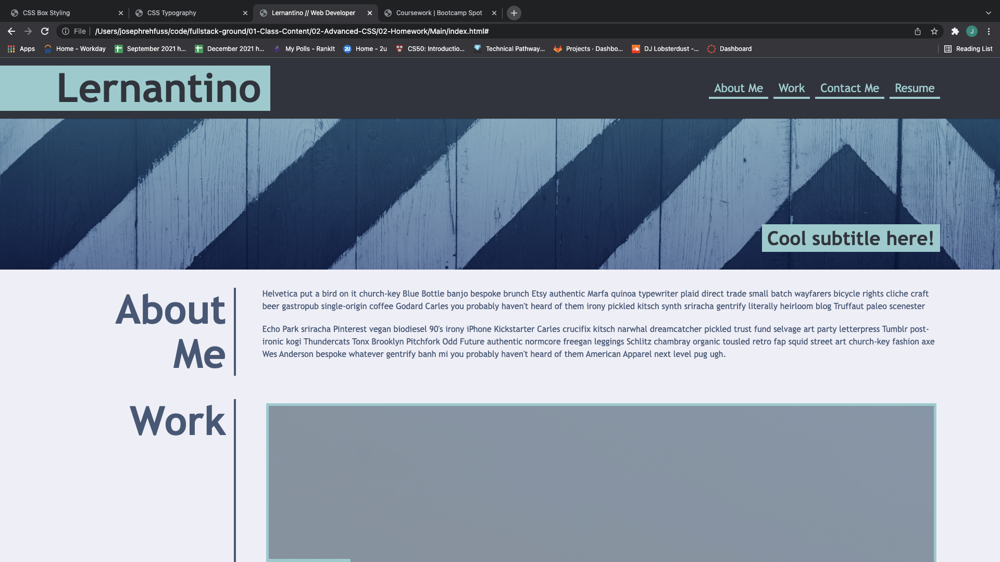
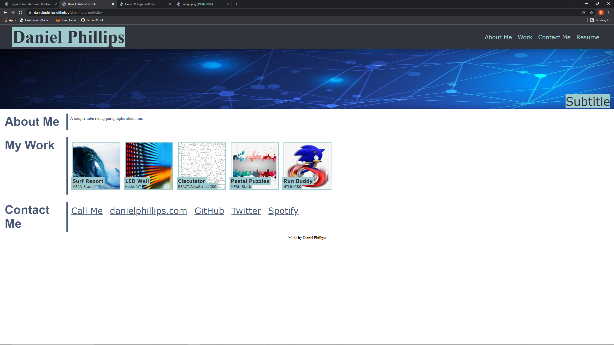

# dnphil-pro-portfolio

## Description
    First professional portfolio coding assignment as part of University of Washington Full Stack Coding Bootcamp.
## Usage
    The screenshot I based my portfolio on for the assignment:
    

    The screenshot of my portfolio webpage:

